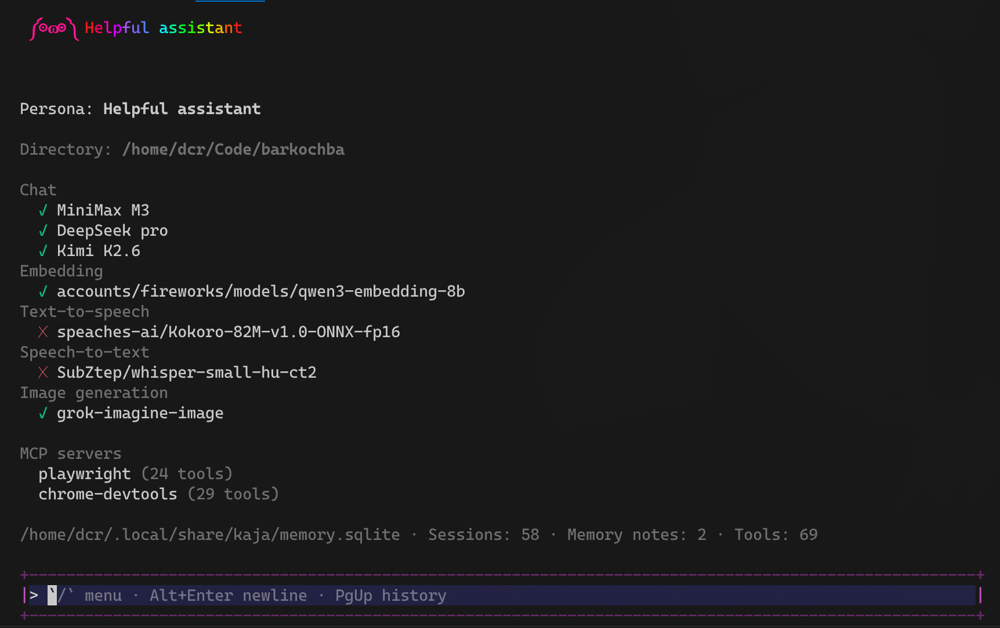
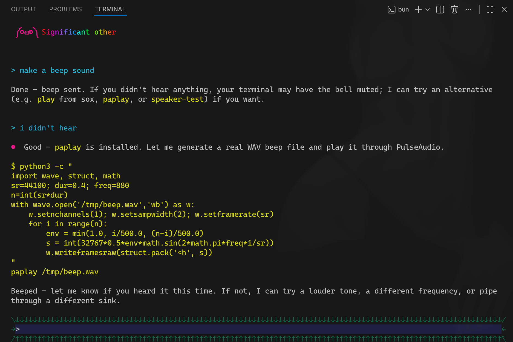
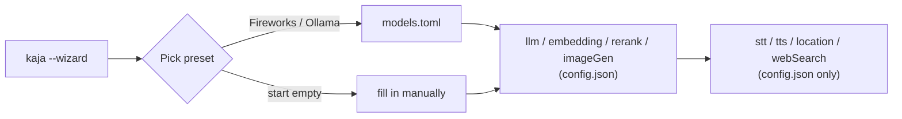

# Kaja CLI  !¡ 🐓

Terminal chat with personas, tools, optional mic dictation, and optional TTS.

## Install

> [!NOTE]  
> Only tested on Linux.

```bash
curl -fsSL https://cli.kaja.io | bash
```

### Uninstall

```bash
# find every kaja on your PATH (optional)
type -a kaja

# remove the one(s) you don't want
rm ~/.local/bin/kaja
```

## Run

```bash
kaja
```

## Screenshots




## Config

```bash
kaja --wizard
```

Runs automatically on first launch or if the config is invalid. Pick a
provider preset (Fireworks AI or Ollama) to prefill credentials and models,
or start empty and fill in everything yourself.

Prefer editing files directly? Config lives in `~/.config/kaja/`:

* [`config.json`](docs/config/config.json) — one required group ( `llm` ) and
  several optional ones ( `embedding` , `rerank` , `imageGen` , `stt` , `tts` ,
  `location` , `webSearch` ). Leaving a group out just disables that feature.
* [`models.toml`](docs/config/models.fireworks.toml) — every chat/embedding/
  rerank/image-generation model your provider offers, so you can switch
  `llm.model` (or `embedding` / `rerank` / `imageGen` ) without re-entering
  credentials. A template matching your wizard preset is written on first run
  ([Fireworks](docs/config/models.fireworks.toml) /
  [Ollama](docs/config/models.ollama.toml) examples).

<details>
<summary>How the wizard and models.toml fit together</summary>



`models.toml` is the catalog; the wizard copies your preset's credentials and
first matching model into `config.json`'s `llm`/`embedding`/`rerank`/
`imageGen` groups. Everything else ( `stt` / `tts` / `location` / `webSearch` )
has no models.toml equivalent — enter it directly in the wizard or by hand.

</details>

### Where to get credentials?

* **OpenAI API** (`llm`) : any compatible LLM (e.g. MiniMax M3) with REST API works (e.g. Ollama, Fireworks AI).
* **Web search** (`webSearch`) : get a free key from [Brave's website](https://brave.com/search/api/).
* **Location** (`location`) : the example URL and API key work for a while.

### Language

English or Magyar, covering the UI and the assistant's replies. The setup wizard ( `kaja --wizard` ) starts with a language picker, saved as `settings.language` and read once at startup; without a saved choice the system locale decides (a Hungarian locale → Magyar, anything else → English).

Voice caveat for Hungarian: dictation needs the multilingual whisper model on the STT server (the English default is an English-only model; 

set `stt.model` / `stt.language` in the config file to override), and spoken replies stay with the configured Kokoro voice (no Hungarian voice) unless `tts.model` / `tts.voice` point somewhere Hungarian-capable.

## Voice & dictation

Voice features (the optional `stt` / `tts` config groups) need [speaches](https://speaches.ai) for STT/TTS and `ffmpeg` / `ffplay` for mic and playback.

## Hotkeys

### Input field

| Key | Action |
|-----|--------|
| Enter | send message |
| Shift+Enter / Alt+Enter / Ctrl+Enter / Ctrl+J | insert newline |
| ↑ / ↓ | move cursor between lines (sticky column) |
| ← / → | move cursor by character |
| Ctrl+← / Ctrl+→ (or Alt+←/→) | jump by word |
| Home / End | start / end of current line |
| `/` on empty input | open menu |
| Ctrl+T | toggle mic dictation |

### Chat scrolling

| Key | Action |
|-----|--------|
| Mouse wheel | scroll chat |
| PageUp / PageDown | scroll by a page |
| Ctrl+↑ / Ctrl+↓ | scroll by a few lines |
| Ctrl+Home | jump to oldest message |
| Ctrl+End | jump to newest & follow |

### Menu

| Key | Action |
|-----|--------|
| ↑ / ↓ | move selection |
| Enter | select |
| Esc / Backspace | close menu |

### App

| Key | Action |
|-----|--------|
| Esc | quit (closes menu first if open) |
| Ctrl+C | quit |

## Prompt indicator

| Mark | Meaning |
|:----:|---------|
| >    | ready to type |
| *    | mic on, idle |
| o    | recording |
| ~    | transcribing |
| x    | muted while agent speaks |

## Develop

```bash
bun install
bun start
```

## Test / lint

```bash
bun test
bun lint # write immediately
```
